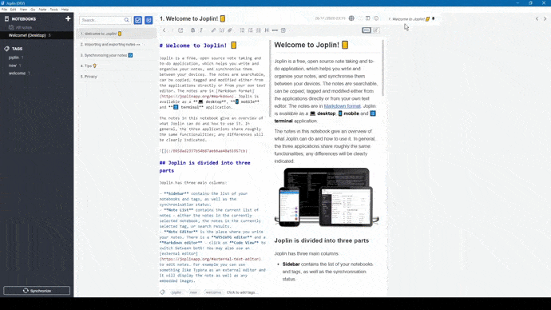
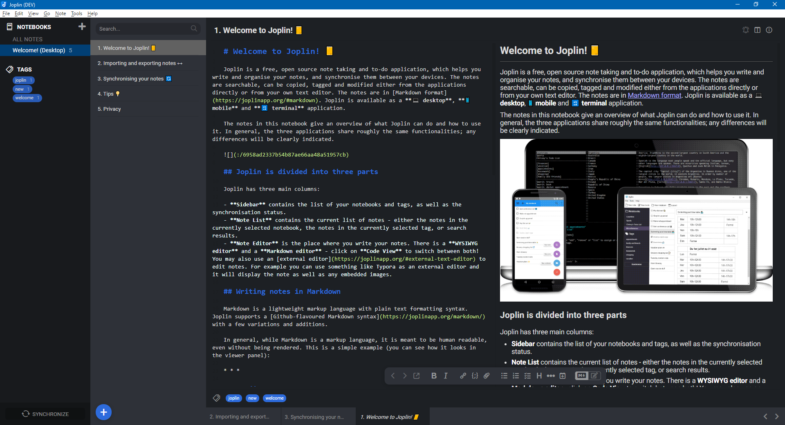

# Joplin Note Tabs

Note Tabs is a plugin to extend the UX and UI of [Joplin's](https://joplinapp.org/) desktop application.

It allows to open several notes at once in tabs and pin them to be kept open.

> :warning: **CAUTION** - Requires Joplin **v1.8.2** or newer

## Features

- Display selected note as tab
- Additional display options below the tabs
  - Navigation buttons (`historyBackward/Forward`)
  - Completion status of all checklists in selected note
  - Full breadcrumbs for selected note
- Pin note(s) to the tabs
  - Either via command or drag & drop from the note list
- Save pinned tabs permanently
  - Stored in database (not synced with other devices!)
- Remember last opened and unpinned note
- Change position of tabs within the panel
  - Either via drag & drop or keyboard shortcuts (which have been assigned to the corresponding commands)
- Toggle to-do state directly on the tabs
  - Optionally unpin completed to-dos automatically
- [Configurable](#user-options) style attributes
- Support horizontal and vertical layout



### Screenshots

#### Tabs above note content


#### Tabs below note content



> **NOTE** - The used UI theme on this screenshot can be downloaded [here](https://github.com/benji300/joplin-wanaka-ui).

#### Tabs beside note content (vertical layout)


> **NOTE** - The used UI theme on this screenshot can be downloaded [here](https://github.com/benji300/joplin-milford-ui).

## Installation

### Automatic (Joplin v1.6.4 and newer)

- Open Joplin and navigate to `Tools > Options > Plugins`
- Search for the plugin name and press install
- Restart Joplin to enable the plugin
- By default the panel will appear on the right side of the screen, see how to [place the panel](#place-the-panel)

### Manual

- Download the latest released JPL package (`*.jpl`) from [here](https://github.com/benji300/joplin-note-tabs/releases)
- Open Joplin and navigate to `Tools > Options > Plugins`
- Press `Install plugin` and select the previously downloaded `jpl` file
- Confirm selection
- Restart Joplin to enable the plugin
- By default the panel will appear on the right side of the screen, see how to [place the panel](#place-the-panel)

### Uninstall

- Open Joplin and navigate to `Tools > Options > Plugins`
- Search for the plugin name and press `Delete` to remove the plugin completely
  - Alternatively you can also disable the plugin by clicking on the toggle button
- Restart Joplin

## Usage

### Place the panel

By default the panel will be on the right side of the screen, this can be adjusted by:

- `View > Change application layout`
- Use the arrow keys (the displayed ones, not keyboard keys) to move the panel at the desired position
- Move the splitter to reach the desired height/width of the panel
  - As soon as the width of the panel goes below `400px`, it automatically switches from horizontal to vertical layout
- Press `ESC` to save the layout and return to normal mode

## Commands

This plugin provides additional commands as described in the following table.

| Command Label             | Command ID             | Description                                                                                   | Menu contexts                                                       |
| ------------------------- | ---------------------- | --------------------------------------------------------------------------------------------- | ------------------------------------------------------------------- |
| Pin note to Tabs          | `tabsPinNote`          | Pin selected note(s) to the tabs.                                                             | `Tools>Tabs`, `NoteListContext`, `EditorContext`, `Command palette` |
| Unpin note from Tabs      | `tabsUnpinNote`        | Unpin selected note(s) from the tabs.                                                         | `Tools>Tabs`, `Command palette`                                     |
| Switch to last active Tab | `tabsSwitchLastActive` | Switch to the last active tab, i.e. to previous selected note.                                | `Tools>Tabs`, `Command palette`                                     |
| Switch to left Tab        | `tabsSwitchLeft`       | Switch to the left tab next to the active, i.e. select the left note.                         | `Tools>Tabs`, `Command palette`                                     |
| Switch to right Tab       | `tabsSwitchRight`      | Switch to the right tab next to the active, i.e. select the right note.                       | `Tools>Tabs`, `Command palette`                                     |
| Move active Tab left      | `tabsMoveLeft`         | Move active tab one position to the left.                                                     | `Tools>Tabs`, `Command palette`                                     |
| Move active Tab right     | `tabsMoveRight`        | Move active tab one position to the right.                                                    | `Tools>Tabs`, `Command palette`                                     |
| Remove all pinned Tabs    | `tabsClear`            | Remove all pinned tabs. In case no note is selected, the tabs list might be empty afterwards. | `Tools>Tabs`, `Command palette`                                     |
| Toggle Tabs visibility    | `tabsToggleVisibility` | Toggle panel visibility.                                                                      | `Tools>Tabs`, `Command palette`                                     |

### Keyboard shortcuts

Keyboard shortcuts can be assigned in user options via `Tools > Options > Keyboard Shortcuts` to all [commands](#commands) which are assigned to the `Tools>Favorites` menu context.
In the keyboard shortcut editor, search for the command label where shortcuts shall be added.

#### Manual workaround
1. Go to Joplin Setting>Keyboard Shortcuts>Export
2.Open the Export .json file with notepad, follow the structure to add command hotkey.
3. Example:
```
[
  {
    "command": "newTodo",
    "accelerator": null
  },
  {
    "command": "textCode",
    "accelerator": null
  },
  {
    "command": "tabsPinNote",
    "accelerator": "Ctrl+T"
  },
  {
    "command": "tabsSwitchLeft",
    "accelerator": "Ctrl+Left"
  },
  {
    "command": "tabsSwitchRight",
    "accelerator": "Ctrl+Right"
  },
  {
    "command": "tabsUnpinNote",
    "accelerator": "Ctrl+W"
  },
  {
    "command": "tabsSwitchLastActive",
    "accelerator": "Ctrl+Tab"
  }
]
```
4. save the file then import at Joplin Setting>Keyboard Shortcuts

## User options

This plugin adds provides user options which can be changed via `Tools > Options > Note Tabs` (Windows App).

> **NOTE** - If `default` is set for an advanced style setting, the corresponding default color, font family, etc. will be used to match the common App look.

> **NOTE** - In case color settings shall be overwritten, they must be specified as valid CSS attribute values, e.g. `#ffffff`, `rgb(255,255,255)`, etc.

## UI Tweaks

If option `Show breadcrumbs below tabs` is enabled in the settings it might be useful to disable the default breadcrumbs below the note title.
Follow these steps to hide it via the `userchrome.css` stylesheet:

- Open Joplin
- Navigate to `Tools > Options > Appearance` and open `Show Advanced Settings`
- Click `Edit` below `Custom stylesheet for Joplin-wide app styles` to open `userchrome.css` in a text editor
- Paste the following snippet into the file
- Save your changes and restart Joplin to see the changes

```css
.rli-editor
  > div
  > div
  > div
  > div[style^="padding-top: 10px; padding-bottom: 10px;"]
  > button {
  display: none !important;
}
```

> **NOTE** - Since there is currently no unique attribute for the breadcrumbs, this can only be done using the workaround from above. However, the behavior may change with each version and it may happen that it no longer works.

## Feedback

- :question: Need help?
  - Ask a question on the [Joplin Forum](https://discourse.joplinapp.org/t/plugin-note-tabs/12752)
- :bulb: An idea to improve or enhance the plugin?
  - Start a new discussion on the [Forum](https://discourse.joplinapp.org/t/plugin-note-tabs/12752) or upvote [popular feature requests](https://github.com/benji300/joplin-note-tabs/issues?q=is%3Aissue+is%3Aopen+label%3Aenhancement+sort%3Areactions-%2B1-desc+)
- :bug: Found a bug?
  - Check the [Forum](https://discourse.joplinapp.org/t/plugin-note-tabs/12752) if anyone else already reported the same issue. Otherwise report it by yourself.

## Support

You like this plugin as much as I do and it improves your daily work with Joplin?

Then I would be very happy if you buy me a :beer: or :coffee: via [PayPal](https://www.paypal.com/donate?hosted_button_id=6FHDGK3PTNU22) :wink:

## Development

The npm package of the plugin can be found [here](https://www.npmjs.com/package/joplin-plugin-note-tabs).

### Building the plugin

If you want to build the plugin by your own simply run `npm run dist`.

### Updating the plugin framework

To update the plugin framework, run `npm run update`.

## Changes

See [CHANGELOG](./CHANGELOG.md) for details.

## License

Copyright (c) 2021 Benjamin Seifert

MIT License. See [LICENSE](./LICENSE) for more information.
